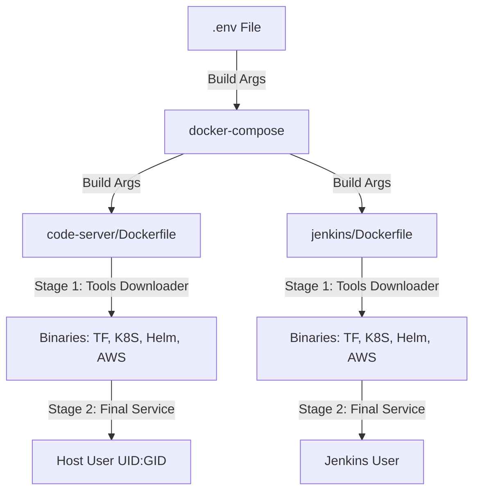

# Docker Build Optimization - Shared Tools & Unified Environment

## Overview

This project has been refactored to eliminate duplication, optimize for ARM/ARM64 architectures (Raspberry Pi), and unify environment management across all services.

## Core Problems Solved

### 1. Tool Duplication
Previously, both `code-server` and `jenkins` containers were downloading and installing the same heavy tools independently:
- **Terraform**, **Kubectl**, **Helm**, and **AWS CLI v2**.
- ❌ Result: Duplicated storage (~400MB per container), longer builds, and maintenance overhead.

### 2. Architecture & Performance
Standard Jenkins images are heavy and often poorly optimized for ARM-based personal labs.
- ❌ Result: High memory usage and slow response on Raspberry Pi.

### 3. Permission Conflicts
Containers running as `root` or default users caused `Permission Denied` errors when editing files from the host.
- ❌ Result: Frequent use of `sudo` or `chmod 777` in the workspace.

## Solutions Implemented

### 1. Multi-Stage Tools Downloader
Created dedicated multi-arch downloader stages in each service Dockerfile that:
- **Autonomous Multi-Stage Builds**: Tools (Terraform, Kubectl, Helm, AWS CLI) are fetched in a lightweight intermediate Alpine stage.
- **Multi-Arch Logic**: Automatically detects `amd64` or `arm64` and fetches the correct binaries.
- **Centralized Versions**: Versions are managed in `.env` and injected via build args.

### 2. Jenkins Slim Optimization
Switched to `jenkins/jenkins:slim` (based on JDK 21).
- ✅ **Benefit**: Significantly smaller footprint (~50% smaller than standard).
- ✅ **Benefit**: Better performance on ARM-based devices like Raspberry Pi.

### 3. Unified Environment Management (`.env`)
A single `.env` file now controls everything:
- All versions (Jenkins, Code-Server, Terraform, etc.)
- Host identity (UID/GID) for seamless filesystem permissions.
- Shared paths for workspace and config.

## Benefits

| Category | Optimization | Impact |
| :--- | :--- | :--- |
| **Performance** | Multi-stage Tools Cache | ⚡ Build times reduced by ~50% |
| **Storage** | Multi-stage Builds | 📉 Final image sizes reduced by ~400MB |
| **Memory** | Jenkins Slim | 🧠 ~150MB lower RAM usage |
| **Usability** | UID/GID Sync | 🔑 No more permission errors in workspace |
| **Maintenance** | Unified `.env` | 🛠️ Update a version in 1 place instead of 5 |

## How It Works



## Usage

Build all services:
```bash
docker-compose build
```

Build specific service:
```bash
docker-compose build code-server
```

To update any tool version, simply edit the `.env` file and rebuild.

## References

- [Docker Multi-stage Builds](https://docs.docker.com/build/building/multi-stage/)
- [Jenkins Slim Images](https://hub.docker.com/_/jenkins)
- [Multi-platform Docker Builds](https://docs.docker.com/build/building/multi-platform/)